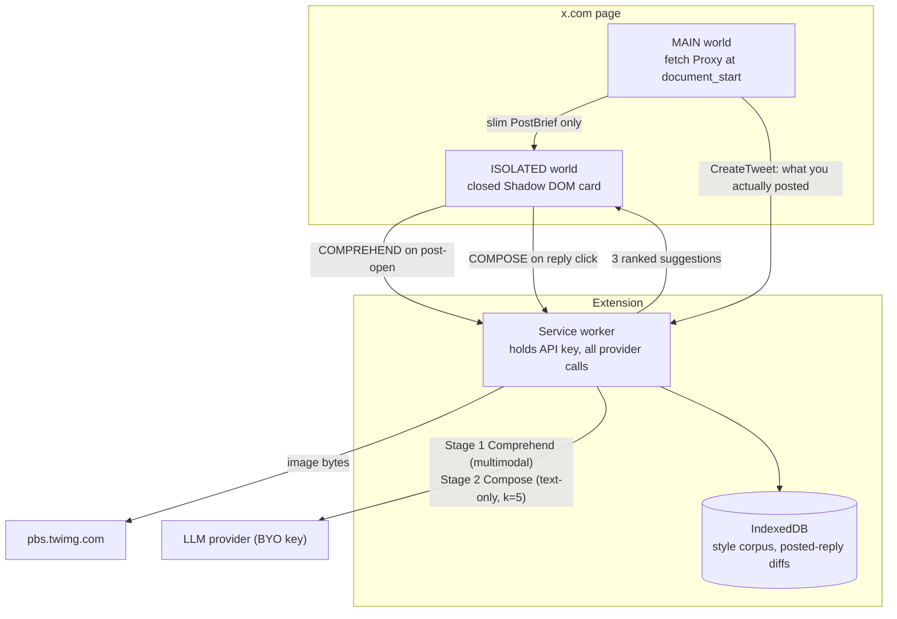
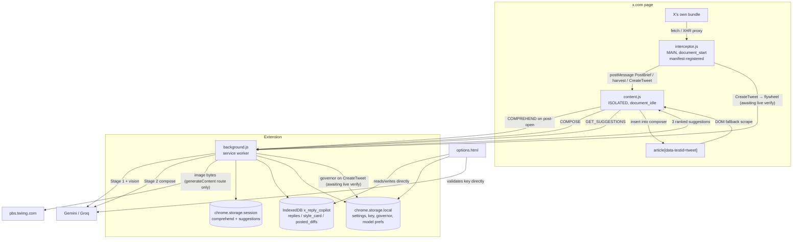

# X Reply Copilot — Architecture, Schema, and Plan-Fidelity Review

**Scope of this document.** A complete map of what is in this repository, how the parts are supposed to
cooperate, what the data actually looks like, how faithfully the implementation followed the original
design plan, and a severity-ordered list of findings. No application code was changed to produce this
document.

**Sources.** The current source tree at `d:\X_agent` (read in full), the generated build output at
`.output/chrome-mv3/`, and the original agreed plan document, recovered verbatim from
`C:\Users\surya\.cursor\projects\d-X-agent\uploads\x_reply_copilot_536d4df2.plan-L1-L184-0.md`
(the same file the build agents were pointed at, referenced in the build conversation). Post-plan
course corrections were recovered from the conversation transcript. Where the plan is quoted below,
it is quoted exactly.

**A note on line numbers.** `lib/composer.ts` and `lib/dom-post-brief.ts` are stored with corrupted
`\r\r\n` line endings (224 and 115 occurrences respectively). Every line number in this document is
the *logical* line number of the code as it reads; `tsc` reports roughly `2N-1` for those two files.
See finding **F14**.

---

## 1. Executive summary

X Reply Copilot is a Chrome Manifest V3 extension that watches the post you are looking at on x.com,
drafts three candidate replies in a measured imitation of your own writing, and offers them in a
floating card next to the reply composer. You pick one, it lands in the composer, and you edit and
post it yourself.

The human-in-the-loop stance is not a UX preference, it is the entire compliance and security
argument, and the original plan is explicit about that on both counts. On compliance, the plan records
that "X's head of product has stated three times in 2026 that the test is whether a human is tapping
the screen, and explicitly blessed AI for proofreading and editing while removing 42,000 accounts for
automated replies." On security, it records that the mitigation of last resort against prompt
injection is the person: "**Never auto-send** — the human is both the compliance story and the security
control." The implementation honours this. There is no code path anywhere in the repository that
submits a reply; the extension's most privileged DOM action is inserting text into a contenteditable.

The economic decision that shaped everything else was to never touch the official X API. The plan's
first research finding states that since February 2026 the API is "pay-per-use at $0.005 per post read
with no free tier. One post plus its top 20 replies is about $0.11 in X fees alone; at 50 replies/day
that is $165-300/month per user before any LLM cost," and adds that registering a developer account is
"net-negative legally," concluding: "**Never register an X developer account for this product.**" No
developer account was ever registered. Instead, the design reads X's own GraphQL responses as the user
browses, at zero marginal cost.

**Current working state, honestly `[reconciled 2026-08-06 / Wave 3]`.** The user-visible loop works:
open a post, click Reply, get three suggestions, insert one with a click or `Ctrl+1/2/3`. Wave 1
registered the MAIN-world GraphQL interceptor at `document_start` (**F1** resolved in the manifest —
live x.com behaviour still unobserved). Prefetch, top-replies, allowlist-before-parse, session
access, observer scoping, and pipeline timing are **implemented in code** and marked *awaiting live
verification*. Wave 2 landed refinement, multimodal, and latency budgets (items 6, 7, 9) — same
status. Wave 3 wired the governor (**F2**, item 11), flywheel learning (**F4**, item 12), confirmed
harvest opt-in default-off (item 13), and the item-15 correctness slice (F8, F9 handle, F10–F13, F18);
`npm run typecheck` exits **0** and is chained into `build`. Live x.com verification for Wave 3 paths
is still outstanding — do not treat those as fully verified.

So: the designed paths are bolted into the code; most have not been proven on a live session.

---

## 2. Repository map

### 2.1 Files that ship

`wxt.config.ts` declares the manifest; WXT derives entrypoints from the `entrypoints/` directory by
convention. The "Context" column is where the code actually executes at runtime.

| File | Lines | Context | Responsibility |
|---|---|---|---|
| `wxt.config.ts` | 54 | build | Manifest name, description, `storage` + `clipboardWrite` permissions, five host permissions. `build:manifestGenerated` hook asserts MAIN-world interceptor at `document_start` and no `web_accessible_resources`. Notably declares **no** `scripting` permission. |
| `entrypoints/interceptor.content.ts` | 380 | MAIN world, `document_start` **(registered 2026-08-06)** | ES6 `Proxy` patch of `window.fetch` plus `XMLHttpRequest.prototype.open/send`; identifies X GraphQL operations, builds a slim `PostBrief`, harvests own replies, catches `CreateTweet`; relays via `window.postMessage`. Preserves native `Function.prototype.toString` for `fetch`. Was `entrypoints/interceptor.main.ts` with `defineUnlistedScript` and never injected — see **F1**, now resolved. |
| `entrypoints/content.ts` | 655 | ISOLATED world, `document_idle` | The whole in-page product. Closed Shadow DOM card, suggestion rendering, refinement chips, `Ctrl/⌘+1/2/3` and `Esc` handling, composer-focus watching, reply-click capture, own-handle detection from the DOM, toasts, and all messaging to the service worker. |
| `entrypoints/card.css` | 4 | ISOLATED world (injected page stylesheet) | Only `#x-reply-copilot-root { all: initial; }`. Real card styles are inlined into the shadow root at `content.ts:372-374` so no extension URL appears in the page. |
| `entrypoints/background.ts` | 494 | service worker | Message router and pipeline orchestrator: `handleComprehend`, `handleCompose`, gate-context assembly, provider selection, corpus and governor calls. Registers `chrome.runtime.onMessage` synchronously at module scope (line 469). |
| `entrypoints/options/index.html` | 13 | options page | Shell; `manifest.open_in_tab` meta. |
| `entrypoints/options/main.tsx` | 10 | options page | React 19 root. |
| `entrypoints/options/App.tsx` | 901 | options page | Four-step onboarding (key → voice → preferences → ready), provider picker, key validation, manual reply import, harvest toggle, "Clear voice data", StyleCard display, data disclosure. |
| `entrypoints/options/style.css` | 245 | options page | Options styling. |
| `lib/types.ts` | 205 | shared | Every cross-context type; operation-name constants; the `ExtensionMessage`/`ExtensionResponse` protocol. |
| `lib/storage.ts` | 67 | shared | `chrome.storage.local` settings under one key, plus `chrome.storage.session` helpers for the comprehend cache, suggestion cache, and last-served suggestion. |
| `lib/graphql-parser.ts` | 294 | MAIN world (via interceptor) | Operation-name extraction from URL path / query / body; the runtime allowlist; defensive `dig()` walker; timeline-instruction and tweet unwrapping; `CreateTweet` and viewer-identity extraction. |
| `lib/post-brief.ts` | 174 | MAIN world + ISOLATED | `buildPostBrief` from GraphQL, `extractOwnReplies` for harvest, and `mergePostBrief` which preserves richer media/replies when a thinner brief arrives. |
| `lib/media.ts` | 108 | MAIN world (via interceptor) | `ext_alt_text` parsing (string or `{alt_text}`), `pbs.twimg.com` sizing with the medium-escalation heuristic, MP4 variant collection. |
| `lib/dom-post-brief.ts` | 116 | ISOLATED world | DOM `PostBrief` scrape (degraded path under P6): tweet article, visible top replies, reply-target from the open composer. GraphQL path is primary once the interceptor is live. |
| `lib/composer.ts` | 225 | ISOLATED world | Composer discovery, clear-then-insert with three insertion methods (synthetic paste → `beforeinput` → `execCommand`), normalized verification, clipboard write, editor-engine detection. |
| `lib/corpus.ts` | 199 | service worker + options page | IndexedDB `x_reply_copilot`: reply corpus CRUD, StyleCard persistence, 5-exemplar selection, manual import, `clearVoiceData`. |
| `lib/style-card.ts` | 109 | service worker + options page | `deriveStyleCard` — the measured voice profile — and its human-readable summary. |
| `lib/prompts.ts` | 479 | service worker | `buildComprehendPrompt`, `buildComposePrompt`, the untrusted-data fencing helper, `DEFAULT_STYLE_CARD`, and the six-layer candidate parser. |
| `lib/rerank.ts` | 182 | service worker | Stage 3: character-trigram author centroid, cosine scoring, the deterministic output gate, and a corpus-free fallback ranker. |
| `lib/gemini.ts` | 1173 | service worker + options page | The largest file. Interactions API and `generateContent` routes, four auth modes, model discovery and fallback, thinking-token control, vision handling, diagnostics. |
| `lib/groq.ts` | 273 | service worker + options page | Alternative provider over the OpenAI-compatible chat-completions endpoint, with a vision model for comprehend. |
| `lib/provider.ts` | 20 | service worker | `AiProviderModule` interface and the `gemini`/`groq` registry. |
| `lib/api-validation.ts` | 20 | service worker + options page | Provider-agnostic key validation entry point. |
| `lib/flywheel.ts` | 119 | service worker | `posted_diffs` store, diff recording, 50-reply StyleCard regeneration trigger, Levenshtein helper. |
| `lib/governor.ts` | — | service worker | Daily budget and per-account counters in `chrome.storage.local`; hard-budget nudge + shape-variance (per-handle target-variety nudge removed). |
| `lib/messaging.ts` | 167 | content script + options page | Service-worker wake and retry wrapper with human-readable MV3 error translation. |
| `lib/debug.ts` | 99 | all | Opt-in harvest/media debug logging plus the always-on generation-failure recorder written to `chrome.storage.local`. |
| `lib/perf.ts` | 80 | all | **Added 2026-08-06.** Always-on `logEntry` proof-of-execution line per entrypoint, `performance.now()` helpers, and the `PipelineTiming` record persisted to `chrome.storage.local.xrcLastPipelineTiming`. |
| `docs/VERIFY.md` | 175 | — | The plan's section-8 empirical checks as a manual checklist. No results recorded. |
| `docs/TROUBLESHOOTING.md` | 143 | — | Genuinely good operational runbook for `AQ.` keys, thinking tokens, and reading a failed generation. |
| `README.md` | 83 | — | Install, key setup, onboarding, permissions, privacy. Partly stale — see **F19**. |

### 2.2 Files that do not ship

`src/` — **deleted 2026-08-06** (backlog item 14 / **F15**). It was an abandoned first-generation
layout (~18 files) that WXT never built. History remains in git. There is no longer a parallel tree to
confuse search-and-edit or pollute `tsc`.

---

## 3. Execution contexts, and why the split exists

Four isolated JavaScript environments cooperate here, and the boundaries are deliberate.

**MAIN world (page context).** A MAIN-world script shares the page's JavaScript realm, which is the
only way to replace `window.fetch` with something X's own code will call. The plan's second research
finding is the whole reason this context exists: "A `document_start` MAIN-world script that proxies
`window.fetch` reads X's own GraphQL responses as you browse. Zero additional requests. It yields
`legacy.full_text`, `note_tweet` long-form text (which the DOM literally never contains for truncated
posts), `extended_entities.media` with video variants, `ext_alt_text` free human-written image
descriptions, and a relevance-ranked reply timeline." The timing matters: `document_start` is required
because the patch must be installed before X's bundle issues its first GraphQL request. The cost of
this realm is that it has no `chrome.*` API access at all, which is why it can only communicate by
`window.postMessage`.

That context also drives two design constraints the plan called out explicitly. First, the patch must
be an ES6 `Proxy` rather than a wrapper function, so that `Function.prototype.toString.call(fetch)`
still returns native source — the plan lists this under detection hygiene, and
`interceptor.main.ts:19` and `:144-151` implement exactly that. Second, the slim `PostBrief` must be
extracted *inside* the MAIN world before posting, because `postMessage` structured-clones its payload
and X's timeline responses are multi-megabyte; serializing one per response would stall the main
thread. `interceptor.main.ts:104-107` does extract before posting.

**ISOLATED world (content script).** Runs on the same DOM but in a separate realm with `chrome.*`
access. This is where all UI and all extension messaging live. Page scripts cannot see its variables,
which is why the API key must never reach it. The card lives in a **closed** shadow root
(`content.ts:343`) with styles inlined, so the page cannot enumerate it via CSS and no
`chrome-extension://` URL ever appears in the DOM — the plan required both.

**Service worker.** Holds the API key and makes every provider call. The plan is unambiguous: "Key
lives only in the service worker via `chrome.storage.local`, never `sync` (which uploads to Google),
never in the content script, never in the page. All provider calls originate from the SW." It also
owns IndexedDB and the governor.

MV3 service workers are killed after roughly 30 seconds of inactivity, which produced a real,
user-visible bug during the build: clicking **Validate & Save** in Options did nothing, because
`sendMessage` to a dead worker rejects with "Receiving end does not exist." Two things came out of that.
`lib/messaging.ts` now sends a `PING` to wake the worker and retries on the delays `[0, 500, 1000, 2000]`
(`messaging.ts:5`), translating MV3 failures into instructions a human can act on (`messaging.ts:37-77`).
And `background.ts:469` registers the `onMessage` listener synchronously at module top level rather than
inside `defineBackground`, so a message that arrives during worker startup is still received. Note the
second consequence of worker death: module-level state in `lib/gemini.ts` (`activeModel`,
`cachedModelOrder` at lines 761-764) is lost on every teardown, which is why the working model and auth
mode are also mirrored into `chrome.storage.local`.

**Options page.** A normal extension page. Because of the inactive-worker problem it was given the
ability to call `validateApiKeyForProvider` and the corpus functions *directly* rather than through the
worker (`App.tsx:192`, `App.tsx:140`). That fixed the bug and broke the key-isolation invariant — see
**F16**.

---

## 4. Architecture

### 4.1 As designed

This is the plan's own diagram, reproduced from the plan document, with the three-stage pipeline
annotated.



### 4.2 As built `[reconciled 2026-08-06]`

Solid edges are wired in code and manifest-registered. Dashed edges are still functionally incomplete
or **awaiting live verification** on x.com.



### 4.3 The live path, end to end

Page loads. `interceptor.js` is registered at `document_start` (MAIN); `content.js` starts at
`document_idle`. Own-handle detection is scoped/debounced (Wave 1 / F6); live Performance proof
outstanding. Designed path: GraphQL `TweetDetail` → slim `PostBrief` → `COMPREHEND` prefetch before
Reply. Degraded path: DOM scrape on reply-click / composer focus.

You click **Reply**. The capture listener finds the enclosing
`article[data-testid="tweet"]` and scrapes a `PostBrief` from it. `setCurrentPost` merges it with
whatever was held before and fires `prefetchComprehend`, which sends `COMPREHEND` to the worker.

The composer takes focus. `focusin` fires `checkFocus` → `showCard()`. The card appears under the
composer. `showCard` tries the session suggestion cache first, then calls `composeSuggestions()`.

The worker runs `handleCompose`: governor check (incl. shape variance over recent diffs), comprehend
(cached or freshly awaited inline; degraded results are not session-cached), StyleCard, exemplars,
provider compose call, parse, rerank, gate, cache, return. Remaining budget is shown on the card.

Three suggestions render. A single click or `Ctrl+1` selects; a second activation (same shortcut or
double-click) runs `insertIntoComposer`, then collapses the card to a small **Suggestions** chip
(click to restore). Insert clears the composer, tries synthetic paste, and treats success as text
match **and** Post `aria-disabled` cleared (F11 — live Lexical proof outstanding). The text is also
copied to the clipboard. You edit and post it yourself. CreateTweet (when observed) increments the
governor and records a flywheel diff.

---

## 5. Data schema

Everything below is transcribed from the source, not paraphrased.

### 5.1 Post context — `lib/types.ts:1-32`

`PostBrief` is the unit of post context that crosses every boundary. It is deliberately small because
it was designed to be structured-cloned across `postMessage`.

```ts
interface PostBrief {
  tweetId: string;
  authorHandle: string;
  authorName: string;
  text: string;
  createdAt?: string;
  media: MediaItem[];
  topReplies: ReplySnippet[];
  url?: string;
}

interface MediaItem {
  type: 'photo' | 'video' | 'animated_gif';
  url: string;
  altText?: string;
  width?: number;
  height?: number;
  videoVariants?: VideoVariant[];
}

interface VideoVariant { url: string; contentType: string; bitrate?: number }
interface ReplySnippet { handle: string; text: string; likeCount?: number }
```

In the live DOM path, `topReplies` is always `[]` (`dom-post-brief.ts:75`), `createdAt` is always
absent, and `media[].width/height/videoVariants` are never populated. `MediaItem.url` carries the
`?format=webp&name=small` query string built by `buildImageUrl` (`media.ts:28-40`).

### 5.2 Voice profile — `lib/types.ts:34-50`

```ts
interface StyleCard {
  medianWordCount: number;
  wordCountP25: number;
  wordCountP75: number;
  contractionRate: number;
  lowercaseOpenerRate: number;
  emojiRate: number;
  exclamationRate: number;
  openers: string[];
  closers: string[];
  signaturePhrases: string[];
  bannedPatterns: string[];
  sampleHandle?: string;
  corpusSize: number;
  updatedAt: number;
}
```

Derived by `deriveStyleCard` (`style-card.ts:50-95`) from the reply corpus. `closers` is hardcoded to
`[]` at line 88 — the plan asked for "opener and closer habits" and only openers were implemented.
The three rate fields have inconsistent units across derivation, prompt, and gate; see **F12**.

`DEFAULT_STYLE_CARD` (`prompts.ts:464-478`) is what the system uses when the corpus is empty, which is
the normal case now that harvesting is off: median 14 words, P25 8, P75 22, contraction rate 0.35,
lowercase-opener rate 0.5, emoji rate 0.05, and `bannedPatterns: ['not X, but Y', 'not just X', "it's not about"]`.

### 5.3 Pipeline types — `lib/types.ts:52-118`

```ts
interface ComprehendResult {
  claim: string;
  tone: string;
  domain: string;
  entities: string[];
  imageDescription: string;
  repliesAlreadySaid: string[];
  tweetId: string;
  cachedAt: number;
}

interface VerbalizedCandidate { text: string; intent: 'Add'|'Ask'|'Push back'; probability: number }
interface Suggestion         { text: string; intent: 'Add'|'Ask'|'Push back'; probability?: number; rank?: number }

interface ComposeRequest {
  postBrief: PostBrief;
  comprehend: ComprehendResult;
  styleCard: StyleCard;
  exemplars: string[];
  conditioning: Conditioning;
  refinement?: RefinementChip;
  username: string;
}

type RefinementChip = 'shorter'|'sharper'|'funnier'|'less_agreeable'|'add_question';
interface Conditioning { knownFor?: string; neverMention?: string; defaultIntent?: 'Add'|'Ask'|'Push back' }

interface PostedReplyDiff {
  tweetId: string;
  suggestionText: string;
  postedText: string;
  suggestionIndex: number;
  timestamp: number;
  editDistance?: number;
  normalizedEditDistance?: number;
}

interface GovernorState { date: string; replyCount: number; accountCounts: Record<string, number> }
interface GovernorStatus { remainingBudget: number; accountReplyCount: number; nudge?: string; blocked?: boolean }
```

`PostedReplyDiff` now carries `editDistance` / `normalizedEditDistance` (Wave 3 / **F4**); live CreateTweet
proof still outstanding.

### 5.4 Settings — `lib/types.ts:73-82`, defaults at `lib/storage.ts:5-12`

```ts
interface UserSettings {
  apiKey?: string;
  apiProvider?: 'gemini' | 'groq';
  conditioning: Conditioning;
  onboardingComplete: boolean;
  dailyReplyBudget: number;
  accountNudgeThreshold: number;
  harvestEnabled?: boolean;
}
```

Defaults: provider `gemini`, `dailyReplyBudget: 50`, `accountNudgeThreshold: 4`, `harvestEnabled: false`.
`accountNudgeThreshold` has no UI control.

### 5.5 Message protocol — `lib/types.ts:163-198`

| Message | Sent from | Handled at | Live? |
|---|---|---|---|
| `PING` | `messaging.ts:87` | `background.ts:330` | yes |
| `COMPREHEND` | `content.ts:253` | `background.ts:356` | yes |
| `COMPOSE` | `content.ts:301` | `background.ts:360` | yes |
| `GET_SUGGESTIONS` | `content.ts:263` | `background.ts:364` | yes |
| `GET_STYLE_CARD` | `App.tsx:252`, `App.tsx:359` | `background.ts:411` | yes |
| `HARVEST_REPLY` | content script ← interceptor | background | wired in code (Wave 3 / item 13); live harvest unproven; gated by `harvestEnabled` default-off |
| `CREATE_TWEET` | content script ← interceptor | background | wired — governor + flywheel (Wave 3); awaiting live CreateTweet observation |
| `VALIDATE_API_KEY` | nowhere | `background.ts` | dead — Options calls the provider directly |
| `IMPORT_MANUAL_REPLIES` | nowhere | `background.ts` | dead — Options calls `importManualReplies` directly |
| `GET_CORPUS_COUNT` | nowhere | `background.ts` | dead |
| `RECORD_POST` | nowhere (optional alt path) | `background.ts` | handler present; primary count path is `CREATE_TWEET` (Wave 3 / **F2**) |
| `GET_GOVERNOR_STATUS` | `content.ts`, `App.tsx` | `background.ts` | wired (Wave 3) — card + Options visible budget |

### 5.6 IndexedDB `x_reply_copilot`, version 1

Schema was historically declared twice (**F5**, now resolved — single owner in `lib/corpus.ts`).

| Store | keyPath | Indexes | Record | Declared in |
|---|---|---|---|---|
| `replies` | `id` autoIncrement | `handle`, `wordCount` | `{ id?, text, handle, wordCount, harvestedAt }` (`corpus.ts:10-16`) | `corpus.ts:25-29` only |
| `style_card` | `key` | — | `{ key: 'current', card: StyleCard }` (`corpus.ts:122`) | `corpus.ts:30-32` only |
| `posted_diffs` | `id` autoIncrement | — | `PostedReplyDiff` | `corpus.ts` only (F5; flywheel imports `openDb`) |

### 5.7 `chrome.storage.local` keys

| Key | Written by | Contents |
|---|---|---|
| `x_reply_copilot_settings` | `storage.ts:22` | The whole `UserSettings` object, API key included |
| `governor_state` | `governor.ts:22` | `GovernorState` |
| `preferredGeminiModel` | `gemini.ts:256` | Last model that worked |
| `geminiAuthMode` | `gemini.ts:256` | Last auth mode that worked |
| `discoveredGeminiModels` | `gemini.ts:275-279` | Flash models returned by ListModels |
| `discoveredGeminiModelsAt` | `gemini.ts:275-279` | Timestamp for 24 h ListModels TTL (Wave 2 / item 9) |
| `xrcLastPipelineTiming` | `lib/perf.ts` | Last Stage 1/2 and click-to-card timing (Wave 1 / item 1) |
| `xrcLastGenerationDebug` | `debug.ts:84,94` | Last generation failure or fallback-parse recovery record |
| `xrc_debug_harvest`, `xrc_debug_media` | manual | Opt-in debug flags |

Nothing uses `chrome.storage.sync`, which the plan required.

### 5.8 `chrome.storage.session` keys

| Key pattern | Written by | Contents |
|---|---|---|
| `comprehend:<tweetId>` | `background.ts:158` | `ComprehendResult` |
| `suggestions:<tweetId>` | `storage.ts:57` | `{ suggestions, timestamp }` |
| `served:<tweetId>` | `storage.ts` | `{ text, index }` — content script write enabled after `setAccessLevel` (**F3** code-landed; live round-trip awaiting verification) |

---

## 6. Runtime flows, step by step

### (a) Post open → interception → PostBrief → Comprehend → session cache

**As designed.** `document_start` MAIN-world patch intercepts the `TweetDetail` response the moment you
open a post; `buildPostBrief` extracts the primary tweet, its media, and its top ten replies;
`postMessage` hands the slim brief to the content script; `setCurrentPost` fires `COMPREHEND`; the
worker calls the multimodal model and caches the result by tweet ID. All of this completes while your
hand is still moving to the Reply button.

**As built (Wave 1).** The interceptor is manifest-registered at `document_start` and the content
script prefetches Comprehend when a brief arrives (`prefetchComprehend`). DOM scrape remains the
degraded path under P6 and still runs on reply-click / composer focus. **Live verification outstanding:**
confirm `TweetDetail` → non-empty brief → `comprehend:<tweetId>` in session storage *before* Reply is
clicked; confirm item-1 timing shows `postOpenToComprehendMs` / warm click-to-card.

`handleComprehend` checks `comprehend:<tweetId>` in session storage,
re-running only if `comprehendMissingImageContext` says a cached result lacks image context for a post
that has media. Otherwise it calls `ai.comprehendPost` and caches the result.

### (b) Reply click → Compose → parse → rerank/gate → card render

`showCard` (`content.ts:436-451`) calls `loadCachedSuggestions` first, then `composeSuggestions()`.
Note that the reply-click handler itself only composes `if (cardVisible || isComposerFocused())`
(`content.ts:623`), neither of which is true at click time, so compose is in practice driven by the
subsequent `focusin`.

`handleCompose` (`background.ts`) then:

1. Reads settings; bails without an API key.
2. `canCompose(postBrief.authorHandle)` — always allows, because nothing ever increments the counters.
3. Fetches or awaits `ComprehendResult`. When uncached this makes Stage 1 a **blocking, serial**
   prerequisite of Stage 2 (warm path / prefetch is the design target — item 4).
4. Starts `getOrCreateStyleCard()` and `buildGateContext(postBrief, refinement)` in parallel
   (Wave 2 / item 9); awaits StyleCard for the prompt, defers gate await until after generation.
5. `resolveRefinementEffect` → `getExemplarsForCompose(effect.targetWordCount)` → `[]` when empty
   (Wave 2 / item 6 — length chips no longer pin exemplars to raw StyleCard median).
6. `ai.composeReplies(apiKey, {...})` → `buildComposePrompt` → provider → `parseCandidatesWithDiagnostics`.
7. Awaits gate context (corpus texts + refinement-aware bounds); branches on corpus size:
   `rerankCandidates` when `corpusTexts.length >= 5`, else `rerankWithoutCorpus`.
8. If every candidate fails the gate, `summarizeGateFailures` produces a reason tally and the user gets
   an actionable error rather than an empty card.
9. Caches the survivors under `suggestions:<tweetId>` and returns them with the governor status.

`renderSuggestions` (`content.ts:518-533`) writes one row per suggestion, escaping `&`, `<`, `>`.

### (c) Suggestion select → second activation → composer insertion

`activateSuggestion` in `content.ts` selects on first click/shortcut; second activation (same
shortcut or double-click) guards re-entry with `isInserting`, records the served suggestion, focuses
the composer, calls `insertIntoComposer` (`composer.ts`), and collapses to the Suggestions chip:

- finds `[data-testid="tweetTextarea_0"]`,
- clears it with `selectAll` + `delete` so the insert replaces rather than appends,
- tries synthetic `paste` with a `DataTransfer` payload,
- verifies with `norm(composerText) === norm(text)`,
- returns immediately on success — the fall-through that caused the double-paste bug is now blocked by
  the `composerHasContent()` early return at `composer.ts:169-171`,
- otherwise clears and tries `beforeinput`/`input` with `inputType: 'insertText'`, then `execCommand('insertText')`.

On success an "Inserted" toast appears, the full card collapses to the Suggestions chip, and the text
is also written to the clipboard. On failure the user is told to paste manually with the
platform-correct shortcut. Post-button `aria-disabled` verification is via `insertLooksSuccessful`
(F11 — live Lexical proof outstanding).

### (d) Refinement chips

Five chips are rendered disabled and enabled only once a compose succeeds (`content.ts:360-366`,
`:497-501`). Clicking one calls `composeSuggestions(chip)`, which re-runs *entire* Stage 2 with a
machine-readable effect from `resolveRefinementEffect` (`prompts.ts:32-101`) — REFINEMENT instruction
first, adjusted Target / exemplars / gate / rerank (Wave 2 / item 6). Prior draft is intentionally not
passed back (directed regeneration). `lastRefinement` is retained so Retry repeats the same chip.
Because comprehend is session-cached, a refinement is a single text-only call. Live before/after
word-count proof for `shorter` still outstanding.

### (e) Voice: manual import, and the now-disabled passive harvest

**Manual import — the live path.** Options → Voice Calibration → paste replies → `importManualReplies`
(`corpus.ts:85-103`), called directly from the page at `App.tsx:308`. It splits on blank lines when
there are several blocks, otherwise on newlines, and calls `harvestReply` per entry, which dedupes on
exact trimmed text (`corpus.ts:64`). Then `rebuildStyleCardFromCorpus` re-derives and persists the
StyleCard, and the UI shows the summary. "Clear voice data" (`App.tsx:351` → `corpus.ts:193-198`)
wipes `replies`, `posted_diffs`, and `style_card`, then re-derives an empty card.

**Passive harvest — opt-in, default-off; implemented, awaiting live verification (Wave 3 / item 13).**
The design: scroll your profile's Replies tab, the interceptor sees `UserTweetsAndReplies`-family
responses, `extractOwnReplies` filters to tweets whose author matches your handle or numeric ID, and
the content script forwards each as `HARVEST_REPLY`. The handler returns early unless
`settings.harvestEnabled` (default `false` — intentional). Interceptor registration stop removed in
Wave 1 / F1; Wave 3 confirms the opt-in path is wired. Live Replies-tab proof with
`xrc_debug_harvest=1` still outstanding.

The disabling was the user's explicit call, recorded in the transcript: *"i think doing comment
harvesting is ruining the comment quality, and it is now commenting irrelevant things from the post.
reset the harvest corpus to 0."*

**With an empty corpus** — the normal state — compose runs against `DEFAULT_STYLE_CARD` with no
exemplars, and the prompt substitutes "No exemplars captured yet — write plainly and conversationally,
no marketing register." (`prompts.ts:84`). Ranking falls to `rerankWithoutCorpus`
(`rerank.ts:171-181`), which is the output gate plus a sort on the model's own self-reported
probability. Stage 3's style scoring does not run at all.

### (f) Flywheel via `CreateTweet`

**As designed.** `CreateTweet` is intercepted; `parseCreateTweet` pulls `full_text` and
`in_reply_to_status_id_str`; the content script relays `CREATE_TWEET`; the worker looks up which
suggestion was served, stores the pair, and every ~50 posted replies regenerates the StyleCard and
shows a before/after.

**As built (Wave 3 / F4 — implemented, awaiting live verification).** Code path:

1. Interceptor can observe `CreateTweet` once live (**F1** registration done; live observation outstanding).
2. Session access for `served:<tweetId>` opened in Wave 1 / **F3** (live write still outstanding).
3. `recordCreateTweet` computes and stores edit distance + normalized distance, inserts `postedText`
   into `replies` via `harvestReply`, then may regenerate (`flywheel.ts:132-158`).
4. Options surfaces `xrcLastStyleRegen` before/after (`App.tsx`); `getAllDiffs` feeds governor shape
   variance.

Outstanding live observables: CreateTweet → flywheel row with real served suggestion; Options
before/after after ~50 real posts.

---

## 7. The provider layer in detail

`lib/provider.ts` defines a three-method interface — `validateApiKey`, `comprehendPost`,
`composeReplies` — and `lib/gemini.ts` and `lib/groq.ts` each implement it as a module namespace.

### 7.1 Two Google key formats, two APIs, four auth modes

The plan assumed a single `AIza` key against `generateContent`. Reality on the user's account was
messier, and `lib/gemini.ts` grew to absorb it. `isAuthKey` (line 163) distinguishes the newer `AQ.`
auth keys from legacy `AIza` keys, and that one bit drives both route order and auth order.

| | `AIza` (legacy) | `AQ.` (2026 auth key) |
|---|---|---|
| Route order | `generateContent`, then Interactions | **Interactions**, then `generateContent` (`gemini.ts:707-710`) |
| Auth order | `?key=`, then `x-goog-api-key` | `x-goog-api-key`, `?key=`, then `Bearer` (`gemini.ts:193-201`) |

`geminiFetchWithAuth` (line 271) walks the auth modes, retrying on 401/403 (and additionally 404 for
ListModels, line 243). The Interactions route posts to `/v1beta/interactions` with an
`Api-Revision: 2026-05-20` header (lines 28-29, 506). The whole situation is documented for humans in
`docs/TROUBLESHOOTING.md`, and `gemini.ts:31-49` even carries copy-pasteable PowerShell smoke tests as
a comment block. Once a route and auth mode succeed they are persisted (`gemini.ts:255-258`) and
preferred next time.

Reading the Interactions response is deliberately paranoid: `extractInteractionText` (line 374) tries
`output_text`, `outputText`, `steps` filtered to `model_output`, then any non-thought step, then the
`generateContent` candidate shape, then a depth-limited sweep for `{type:'text'}` nodes. It also
distinguishes "no output" from "the model spent its whole budget thinking" and says so in the error
(lines 536-547).

### 7.2 Model discovery and fallback

The plan pinned `gemini-2.5-flash-lite`. Discovery via ListModels remains for keys that expose a
subset of flash models. Preference order is now
`['gemini-2.5-flash-lite','gemini-3.1-flash-lite','gemini-3.5-flash-lite','gemini-2.5-flash', …]`.
Options persists `UserSettings.geminiModel` (default `gemini-2.5-flash-lite`). When that pin is set,
`resolveModelOrder` returns **only** the pinned model — no silent cascade to Flash (required for
honest A/B latency tests). `preferredGeminiModel` is kept in sync on success.

Compose may attach an explicit `createCachedContent` resource for the stable prompt prefix
(`lib/gemini-cache.ts` + `buildComposeCachePrefix`); dynamic fenced post content stays out of the
cache (I7). Under-min-token creates are skipped with a log; compose falls back to the full prompt.

### 7.3 Thinking-token control

This was the single hardest bug in the project. `gemini-2.5-flash` is a reasoning model whose thinking
tokens are drawn from the same `max_output_tokens` budget as the answer, so a 1024-token compose ceiling
was consumed by reasoning and the JSON stopped mid-object. It surfaced to the user as "Failed to parse
compose candidates," and one earlier fix that rewrote the JSON wrapper missed entirely. The eventual
diagnosis, quoted from the transcript: *"The response was never malformed — it was never finished... The
code never read the Interactions API's `status` field, so truncation was invisible and surfaced as a
parse error."*

The remedy, all in `lib/gemini.ts`:

- `interactionsThinkingConfig()` sends `thinking_level: 'minimal'`, `thinking_summaries: 'none'`.
- `generateContentThinkingConfig(model)` sends `thinkingConfig.thinkingBudget: 0` for `gemini-2.5*`,
  and `thinkingConfig.thinkingLevel: 'minimal'` for `gemini-3*` (3.x cannot fully disable thinking).
- `isConfigRejection` detects a 400 caused by the thinking fields and retries once without them.
  Wave 2 / item 9 capped that path: `inflatedTokenBudget` = `min(maxTokens + 512, 5120)` so compose
  falls back at **4608**. The old 16384 ceiling is gone. Happy-path 2.5 `thinkingBudget: 0` is
  unchanged (§4 R4).
- Budgets: compose **4096**, comprehend **2048**, vision **512**, key-validation probe **256**.
  Wall-clock abandon further model fallbacks after **8 s** (`COMPOSE_WALL_CLOCK_MS`); ListModels list
  persisted with `discoveredGeminiModelsAt` + 24 h TTL.
- Truncation is detected explicitly — `status === 'incomplete' || 'budget_exceeded'` on Interactions,
  `finishReason === 'MAX_TOKENS'` on `generateContent` — and surfaced in the error text.
- Token usage is aggregated in `lib/usage.ts` (`xrcUsageLedger`) for the Options dashboard and card
  spend chip; rates stamped `2026-08-07` (3.5-flash-lite user-verified).

This is worth flagging against the plan, which anticipated the class of problem: "Gemini 3.x Flash
models emit reasoning tokens before the first visible token, pushing TTFT to 6-8s at defaults. Pin the
thinking level or stay on 2.5." The advice was right; what the plan did not anticipate was that
`2.5-flash` (as opposed to `2.5-flash-lite`) is itself a hybrid reasoning model.

### 7.4 Multimodal handling

Compose is text-only by design. Images reach it as *text*, via `ComprehendResult.imageDescription`,
which `buildComposePrompt` injects in `<untrusted_post_image>` (`prompts.ts:176-188`). When media
exists but cannot be described, the fence carries `MEDIA_UNREADABLE` rather than omitting the block
(Wave 2 / item 7 / §7.4).

`comprehendPost` (`gemini.ts:1100-1156`) describes up to `MAX_DESCRIBE_MEDIA` (4) items in parallel
via `selectMediaForDescription` / `describeOneMediaItem`:

1. `altText` if present — free, human-written, no VLM call (`ext_alt_text`-first).
2. Otherwise a vision call with `imageUri` at the `pbs.twimg.com` poster/URL.
3. If that throws, `fetchImageAsBase64` and retry with `inlineData`.
4. Per-type fallbacks via `fallbackDescriptionForMedia` (GIF / video poster-only strings).

GIFs ride the video-family path (`animated_gif` in GraphQL `media.ts:79-88`; DOM
`tweet_video_thumb` → `animated_gif` in `dom-post-brief.ts:80-91`). Whether live GraphQL always
includes `video_info` on GIFs is **UNVERIFIED**. Live proof per media kind still needs the user.
**F22** (first-image-only) is closed in code; live four-photo proof outstanding.

The two routes need different image encodings: Interactions takes
`{type:'image', uri|data, mime_type}`; `generateContent` requires inline base64 via
`resolvePartsForGenerateContent`.

### 7.5 Groq as the alternative

`lib/groq.ts` is a thinner implementation of the same interface against
`https://api.groq.com/openai/v1/chat/completions` with `Bearer` auth. Vision uses
`qwen/qwen3.6-27b` with a base64 data URL (including poster frames for video/GIF via
`describeOneMediaItem`); text tries
`llama-3.3-70b-versatile` → `qwen/qwen3-32b` → `llama-3.1-8b-instant`. It reuses the same prompt
builders, media helpers (up to 4 + `MEDIA_UNREADABLE`), and layered parser; compose budget is 2048.
Remaining asymmetries with Gemini: vision output budget **100** vs 512 (`groq.ts:206`); comprehend
**300** vs 2048 (`:235`); comprehend parse failure is still not recorded (`:236-250`) — the
silent-degradation problem fixed for Gemini still exists for Groq `[D7]`.

### 7.6 Layered parsing and diagnostics

`parseCandidatesWithDiagnostics` (`prompts.ts:398-433`) tries six strategies in order and returns the
first that yields anything, along with the strategy name and a truncation flag:

| Strategy | Mechanism |
|---|---|
| `strict-json` | `JSON.parse` of the fence-stripped body |
| `fenced-json` | Every ```` ``` ```` block parsed independently |
| `object-scan` | String-aware balanced `{...}` spans at depth 0 |
| `array-scan` | String-aware balanced `[...]` spans at depth 0 |
| `salvaged-json` | Every balanced `{...}` at **any** nesting depth — recovers complete candidate objects out of a container that was never closed |
| `plain-text` | Numbered lines, then bullets, then quoted strings, then bare lines |

The supporting machinery is thoughtful. `balancedSpans` and `nestedObjectSpans` (lines 264, 301) track
string state so a brace inside a quoted reply cannot break the scan, and the comment at line 263
explains why a greedy `/\{[\s\S]*\}/` was rejected. `normalizeIntent` (line 130) maps unrecognized
angle labels onto the three-value union instead of dropping the candidate, with the reasoning stated in
the docstring: "Dropping on a strict enum is how five perfectly good drafts turn into a parse error."
`firstString`/`firstValue` accept a wide range of key aliases. `isUsableText` (line 195) filters JSON
scaffolding out of plain-text salvage.

Diagnostics are genuinely good. Every failure writes a `GenerationDebugRecord` (`debug.ts:58-78`) to
both the console and `chrome.storage.local.xrcLastGenerationDebug`, carrying model, route, auth mode,
HTTP status, interaction status, finish reason, safety, usage, token ceiling, parse strategy, prompt
length, and a 2000-character raw preview. Any non-`strict-json` success is logged as a *recovery*
(`gemini.ts:1167-1169`), so a model quietly ignoring the JSON contract is visible rather than silent.

One consequence deserves naming: when `plain-text` salvage fires, `finalize` (`prompts.ts:371`) assigns
every candidate the uniform probability `1/n`. That is the right fallback, but it flattens the very
signal that verbalized sampling exists to produce, and it is the signal `rerankCandidates` weights at
0.2 and `rerankWithoutCorpus` sorts on exclusively. A salvaged generation therefore silently degrades
ranking to arbitrary order.

### 7.7 Prompt construction

`buildComposePrompt` assembles, in order: a third-person completion instruction;
measured style facts; conditioning; a fenced "don't repeat these" list; exemplars or the no-exemplar
substitute; fenced claim, tone, post text, and image description; the refinement line; and the JSON
output contract. Fenced blocks use `fenceUntrusted`, which wraps content in
`<untrusted_*>…</untrusted_*>` tags and neutralizes embedded fence delimiters — the plan's requirement
that "post content never enters the instruction channel, only a fenced untrusted-data block."
`repliesAlreadySaid` is fenced (Wave 1); the unfenced author handle in `buildComprehendPrompt` remains
— see **F9**.

---

## 8. Plan fidelity assessment

Verified by reading code, not by trusting status markers. Worth noting the failure mode this guards
against: the build agent marked all twelve todos `completed`, and the summary reported "All 12 plan
todos are done" — at a point when passive harvesting had never once worked for the user, and never did
across the remainder of the conversation.

| id | Verdict | Evidence |
|---|---|---|
| `scaffold` | **Mostly — foundation registered, live-unverified** | WXT MV3 ✓, ISOLATED content script ✓, SW ✓, options ✓. MAIN-world interceptor is `entrypoints/interceptor.content.ts` with `world: 'MAIN'`, `runAt: 'document_start'` — second manifest `content_scripts` entry verified 2026-08-06. Native `toString` preservation uses unbound-fetch `nativeToString`. Live page-console execution still unobserved. **F1** resolved in manifest. |
| `interceptor` | **Implemented; awaiting live verification** | Slim `PostBrief` in MAIN before `postMessage` ✓. Allowlist-before-parse ✓ (**F7**). Runtime sets derived from `types.ts` constants (**F20**). Harvest regex gone; structural P4 fallbacks retained. Live `TweetDetail` / DM-drop observables outstanding. |
| `media` | **Implemented in code incl. GIF/multi-image (Wave 2); awaiting live verification** | `ext_alt_text` first ✓, sizing heuristic ✓, video/GIF poster frame ✓, up to 4 images + partial-view / unavailability ✓. 3-keyframe canvas path correctly **deferred**. GraphQL media path reachable after Wave 1; live rich-media capture unobserved. DOM scrape remains the degraded path. Live GraphQL `video_info` on GIFs **UNVERIFIED**. `pickLowestBitrateVariant` still has zero call sites. |
| `generate-v1` | **Superseded as planned; two deviations** | Single-stage generation existed and was replaced by the three-stage pipeline per the plan's own phasing. Deviations: the model is not `2.5-flash-lite` (discovery + fallback, `gemini.ts:767-829`), and the key is not held only in the service worker (`App.tsx:192`). **F16** |
| `card-ui` | **Implemented in code; Post-button verify awaiting live proof** | Closed shadow root ✓. Zero `web_accessible_resources` ✓. No `chrome-extension://` URL in the DOM ✓. Synthetic paste primary with `execCommand` fallback ✓. Clipboard write on card click ✓. **Post-button `aria-disabled` verification** wired via `insertLooksSuccessful` (`composer.ts:95-97`) — **F11** code-landed Wave 3; live Lexical composer proof outstanding. |
| `corpus` | **Implemented, deliberately opt-in default-off** | IndexedDB stores and CRUD ✓; single schema owner at `DB_VERSION` 2 (**F5** resolved). `deriveStyleCard` ✓. Auto harvest gated off by default at the user's request; interceptor stop removed; Wave 3 / item 13 marks the opt-in path **implemented, awaiting live verification**. |
| `voice` | **Implemented as planned** | Third-person completion framing ✓ — `prompts.ts:67` reads "Complete what @{username} would post as a reply. Write in third person… do NOT address the reader as 'you'." Exactly 5 exemplars ✓ (`corpus.ts:179`, `COMPOSE_CANDIDATE_COUNT = 5` at `prompts.ts:3`). Selection by matched length with spread bucketing and **not** topical similarity ✓ (`corpus.ts:141-167`; the prompt even says "match length and register, NOT topic" at `prompts.ts:81`). Verbalized sampling at k=5 ✓ (`prompts.ts:43-60`). Temperature 1.0 ✓ (`gemini.ts:489`, `:595`), matching the plan's "Target T≈1.0". Partial on "snippet seeding" — the exemplar block is the nearest equivalent; there is no separate seeded-prefix mechanism. |
| `rerank` | **Implemented differently — only the n-gram half shipped** | **No Wegmann style embedding** (OOS-1). Character-trigram cosine + probability scoring; no held-out calibration. Deterministic output gate covers hashtags, unknown `@handles`, length bounds, banned words, and antithesis patterns. Wave 3 closed **F12** (per-reply emoji units) and **F13** (regex `bannedPatterns` + prose prompt). URLs still silently stripped rather than rejected. |
| `prefetch` | **Implemented in code; awaiting live verification** | Comprehend/Compose split + session cache ✓. Post-open prefetch wired once GraphQL/DOM brief arrives (`prefetchComprehend`). Timing instrumentation exists (`lib/perf.ts`, `xrcLastPipelineTiming`) but no real latency numbers yet. Wave 2 / item 9 bounded fallbacks (8 s wall-clock, ListModels TTL, config-rejection 5120, messaging 12 s) — warm ≤1200 ms still unproven (**F17**). |
| `flywheel` | **Implemented in code; awaiting live verification** | Wave 3 / **F4**: edit distance stored, posted text inserted into `replies`, StyleCard regen from harvest+posted, Options before/after via `xrcLastStyleRegen`. Depends on live CreateTweet + served suggestion (items 2, 10). |
| `governor` | **Implemented in code; awaiting live verification** | Wave 3 / **F2**: `CREATE_TWEET` calls `recordReplyToAccount` with sanitized handle; `checkShapeVariance` over recent diffs; `GET_GOVERNOR_STATUS` rendered on card + Options. Disclosure met in substance (static text + "Reading this post"); no affirmative acceptance gate (Q4 / F19). |
| `verify` | **Not done** | `docs/VERIFY.md` is a well-written checklist of all five plan checks plus seven more, with **no recorded results anywhere** in the repository. Two checks have helpers that are never called: `detectComposerEngine` (`composer.ts:212`) for Draft.js vs Lexical, and `isPostButtonEnabled` for the insert verification. No `countTokens` call exists for the Gemini video token-rate question. No reranker calibration harness exists. The transcript shows the composer questions being settled by user bug reports — double-paste, wrong modifier key on Windows — rather than by the planned probes, and `VERIFY.md` itself references a DB name, store name, and message type that do not exist (**F19**). |

---

## 9. Deviations from the original research and plan, and why

### D1. The MAIN-world interceptor was never wired in — unintentional, and the most consequential

> **Resolved as a deviation 2026-08-06** (Wave 1 / F1). Historical record kept below. The entrypoint
> is now a MAIN-world content script at `document_start`; see F1 resolution note.

**The plan said:** a `document_start` MAIN-world `fetch` proxy is the foundation. It is research finding
#2, it is the top box in the architecture diagram, and it is what makes the whole product cost nothing.

**What happened:** the file was written completely and correctly, then declared with
`defineUnlistedScript` (`interceptor.main.ts:269`). WXT builds unlisted scripts to a standalone bundle
that the developer must inject; it does not register them. The manifest was never given a MAIN-world
content script, `web_accessible_resources`, or the `scripting` permission, and no code calls
`injectScript` or `chrome.scripting.executeScript`. So `.output/chrome-mv3/interceptor.js` is 10.9 kB of
dead weight in every build.

**What it cost:** the GraphQL data advantage the architecture was chosen for — `note_tweet` long-form
text, `ext_alt_text`, video variants, and the relevance-ranked reply timeline. The reply-avoidance
signal the plan singled out as the differentiator ("Telling the model 'these six things have already
been said' is what prevents the eighth variant of 'great thread.' It is free… and none of the roughly
six existing open-source competitors use it") is inert, because `topReplies` is always empty in the DOM
path. Passive harvesting never worked. `CreateTweet` never arrives, so the flywheel has no ground truth.
And the prefetch design collapses, because there is no post-open signal at all.

**The diagnostic history matters here.** The transcript shows harvesting being "fixed" three separate
times — wrong operation name, operation name in the URL path, own handle never detected, profile tweets
wrapped in an unwrapped visibility layer — each fix landing inside `graphql-parser.ts` or
`post-brief.ts`, none of them questioning whether the interceptor was running at all. The user reported
it broken after every one: *"the voice and replies harvesting still doesn't work."* Four plausible
causes were found and repaired inside a module that never executes.

### D2. `gemini-2.5-flash-lite` → runtime model discovery with ordered fallback

**The plan said:** pin `gemini-2.5-flash-lite`, at "~0.31s to first token, ~1.1s total for image+text,
at ~$0.31 per *thousand* calls."

**What forced the change:** ListModels on the user's key did not return flash-lite. Hardcoding it meant
a valid key reporting as invalid.

**What it bought:** the extension now works on whatever the key exposes (`gemini.ts:767-829`).
**What it cost:** the actual model in use is `gemini-2.5-flash`, a hybrid reasoning model — which
produced D4 — and the plan's latency figures no longer describe the system. A ListModels round trip is
also now added to the first call after every service-worker cold start.

### D3. `AQ.` keys forced the Interactions API to become the primary route

**Not anticipated by the plan at all.** Google AI Studio began issuing `AQ.`-prefixed auth keys, and
`generateContent` frequently returns 404 for them while ListModels works. The response was dual routing
with per-key-format ordering and four auth modes (`gemini.ts:25`, `:193-237`, `:697-739`), plus
persistence of whichever combination worked.

**Cost:** `lib/gemini.ts` is 1,173 lines, most of it transport negotiation, and it is by a wide margin
the most complex file in the project. **Bought:** it works on both key formats without user
configuration, and `docs/TROUBLESHOOTING.md` turns the mess into something a human can debug.

### D4. Thinking tokens sharing the output budget — the "Failed to parse compose candidates" saga

Covered in §7.3. The plan's own caveat — "Pin the thinking level or stay on 2.5" — was correct advice
that D2 made impossible to follow, since the only available 2.5 model was itself a reasoning model.

**Cost:** two failed diagnoses before the real one, and a compose budget four times the original.
**Bought:** truncation is now a first-class, named, user-visible condition rather than an opaque parse
error.

### D5. Strict JSON parsing → six-layer salvage

**The plan said** Stage 1 "emits structured JSON so injected text cannot survive verbatim into Stage 2"
— structure was a *security* property, not just an ergonomic one.

**What it bought:** generation essentially cannot fail on formatting any more.
**What it cost:** two things worth naming. Uniform `1/n` probabilities on plain-text salvage flatten the
verbalized-sampling signal the reranker consumes. And the plan's argument that JSON structure blocks
prompt injection from surviving into Stage 2 weakens once free prose is an accepted output shape.

### D6. Passive harvesting disabled by default; manual paste became the primary voice path

**The plan said** voice calibration was "the trust moment": *"Open your profile, click Replies, hold End
for 60 seconds"*, followed by showing the user their own StyleCard — *"Seeing an accurate mirror of
yourself is what earns the install."* Manual pasting was explicitly the **fallback for thin accounts**:
"6 archetypes plus 3 pasted examples."

**What forced the change:** the user's judgement, quoted in D1's section above. `harvestEnabled` now
defaults to `false` (`storage.ts:11`), gated at `background.ts:377-381`, with a "Clear voice data"
button (`App.tsx:340-368`) and manual import as the primary route.

**What it cost:** the plan's entire onboarding trust moment, and Stage 3. With an empty corpus the
system runs on `DEFAULT_STYLE_CARD`, no exemplars, and `rerankWithoutCorpus` — the gate plus the model's
own self-reported probability. Style-similarity scoring does not run. The product's stated
differentiator ("Voice: the actual differentiator") is off by default. Note also that the roles have
inverted relative to the plan: the fallback is now the primary, and the primary is a disabled
experimental toggle. It is also worth being candid that the causal attribution is unproven — off-topic
replies were more plausibly caused by the empty `topReplies` avoidance signal, or by exemplars selected
purely on length with no topical grounding, than by the corpus itself.

### D7. Groq added as a second provider

Not in the plan, which assumed a single BYO Gemini key. Added at the user's request after the
key-validation failures. The provider abstraction (`lib/provider.ts`) is clean and this is a genuine
improvement in optionality. Cost: a second implementation to keep in sync, and it has already drifted —
Groq's comprehend has no failure logging and a 300-token ceiling.

### D8. Key validation moved out of the service worker into the Options page

**The plan said:** key "never in the content script, never in the page. All provider calls originate
from the SW."

**What forced the change:** validation failed silently against a sleeping worker, and the user could not
get past step 1 of onboarding. Validating in-page removed the dependency entirely (`App.tsx:190-192`).

**What it cost:** the invariant. The key is now read into React state (`App.tsx:124`), used for outbound
network calls from the page context, and `lib/gemini.ts` writes model preferences from there too. This
is a pragmatic trade — an options page is a first-party extension page, not a content script, so the
exposure is much smaller than the plan's worst case — but the documented guarantee in
`README.md:70-71` is now broader than the code.

### D9. The Wegmann style-embedding reranker was never built

**The plan said:** "**Local rerank** with `AnnaWegmann/Style-Embedding` (~125M, conversation-controlled
contrastive training, closest available match to X replies) against a precomputed author centroid.
Calibrate against the distribution of your own held-out replies rather than an absolute threshold, since
none of these models is validated at 40-word length. Ensemble with character n-gram distance, which
degrades most gracefully at short lengths."

**What shipped:** only the ensemble's second member. Character trigram cosine against a summed corpus
vector, no embedding model, no calibration. The plan also required calibration specifically *because*
"none of these models is validated at that length" — and the calibration is exactly what is missing, so
the reranker's scores have no known relationship to human judgement. This one appears to be silent
scope reduction rather than a forced trade: nothing in the transcript records a decision to drop it.

### D10. Composer insertion rewritten to clear-then-insert with a re-entry guard

**The plan said:** "sources actively disagree on paste vs execCommand; ship both and verify the Post
button's `aria-disabled` after every insert."

**What forced the change:** *"it is now pasting the same comment twice."* Both paste and `execCommand`
were succeeding. The rewrite (`composer.ts:155-187`) clears first, uses a single target, verifies by
exact normalized comparison, and returns without fall-through; `content.ts:549` adds an `isInserting`
guard. A `beforeinput` method was also added between the two the plan named, which is the right thing
for a Lexical editor.

This is a deviation that improved on the plan. The half that was dropped is the verification method: the
plan wanted the Post button's `aria-disabled` checked, and the code checks text equality instead —
which cannot detect the case where X's editor accepted the text visually but did not commit it to its
internal model.

---

## 10. Findings, ordered by severity

Reported, not fixed. Each entry gives the location and a concrete remedy.

### F1 — Critical: the MAIN-world interceptor is never injected, so the entire GraphQL layer is dead code

> **RESOLVED 2026-08-06** (backlog item 2). The entrypoint was renamed to
> `entrypoints/interceptor.content.ts` and now uses
> `defineContentScript({ matches, world: 'MAIN', runAt: 'document_start', globalName: false })`.
> The generated manifest carries a second `content_scripts` entry —
> `{"matches":["https://twitter.com/*","https://x.com/*"],"run_at":"document_start","js":["content-scripts/interceptor.js"],"world":"MAIN"}` —
> and still has no `web_accessible_resources` and no `scripting` permission, so I5 holds.
> A `build:manifestGenerated` hook in `wxt.config.ts` fails the build if the MAIN-world entry,
> the interceptor bundle path, or the absence of `web_accessible_resources` ever regresses.
> Verified by executing the built bundle against synthetic GraphQL responses; behaviour on a
> live x.com session is still unobserved.

`entrypoints/interceptor.main.ts:269` uses `defineUnlistedScript`. The generated manifest
(`.output/chrome-mv3/manifest.json`) contains exactly one content script —
`content-scripts/content.js`, `run_at: document_idle`, no `world` key — and no `web_accessible_resources`
and no `scripting` permission. A full-text search of the build output finds the string `interceptor`
only inside `interceptor.js` itself. No source file calls `injectScript` or `chrome.scripting.*`.

Dead as a result: `lib/graphql-parser.ts` (294 lines), `lib/media.ts` (108 lines),
`buildPostBrief` and `extractOwnReplies` in `lib/post-brief.ts`, the fetch/XHR proxies, `CreateTweet`
capture, and the `HARVEST_REPLY` and `CREATE_TWEET` message paths. Roughly 700 lines of the most
carefully written code in the repository never executes.

**Remedy:** convert the entrypoint to a content script and let the manifest register it —
`export default defineContentScript({ matches: ['https://x.com/*','https://twitter.com/*'], world: 'MAIN', runAt: 'document_start', main() {...} })`
— then verify `"world": "MAIN"` appears on a second `content_scripts` entry in the generated manifest.
The alternative (add `web_accessible_resources` plus `injectScript` from `content.ts`) reintroduces an
extension URL into the page, which the plan's detection-hygiene requirement rules out. Add a build-time
assertion on the manifest so this cannot regress silently.

### F2 — Critical: the rate governor never counts anything, so the daily budget never engages

> **RESOLVED IN CODE 2026-08-06** (Wave 3 / backlog item 11). **Implemented, awaiting live
> verification.** `handleCreateTweet` calls `recordReplyToAccount(sanitizeAuthorHandle(...))`
> (`background.ts:308-324`); `enrichGovernorStatus` wires `checkShapeVariance` over recent
> `posted_diffs` (`:192-201`); card + Options send `GET_GOVERNOR_STATUS` and show remaining budget.
> Outstanding live observables: CreateTweet → governor increments; card budget updates after posts.

Historical defect (pre-Wave 3): `recordReplyToAccount` was only reachable via unsent `RECORD_POST`;
`CREATE_TWEET` did not count; handle was a tweet ID; `checkShapeVariance` and visible budget were
absent. Plan rationale: shadowban risk on volume and repetition alone.

### F3 — High: `chrome.storage.session` is unreachable from the content script, silently

> **RESOLVED 2026-08-06** (backlog item 10). The service worker calls
> `chrome.storage.session.setAccessLevel({ accessLevel: 'TRUSTED_AND_UNTRUSTED_CONTEXTS' })`
> inside `defineBackground`'s `main` (guarded, because WXT imports the module in Node at build
> time where the shim has no such method). `setLastServedSuggestion` in `content.ts` is no
> longer `void`-ed and logs on rejection, as do the three storage writes in `lib/debug.ts` and
> the `chrome.runtime.sendMessage` relay. That `served:<tweetId>` is actually written needs a
> live session to confirm.

`content.ts:551` calls `setLastServedSuggestion` (`storage.ts:64` → `storage.ts:49`
`chrome.storage.session.set`). `chrome.storage.session` defaults to `TRUSTED_CONTEXTS`, which excludes
content scripts, and there is no `chrome.storage.session.setAccessLevel(...)` call anywhere in the
repository. The call therefore rejects with an access error. It is `void`-ed, so the rejection is
unhandled and invisible.

Consequence: `served:<tweetId>` is never written, `getLastServedSuggestion` (`background.ts:314`, `:423`)
always returns `undefined`, and every `PostedReplyDiff` would carry an empty `suggestionText`. This
independently breaks the flywheel's strongest signal — the plan ranked "the diff between the suggestion
and what you posted" as *strong*, above which suggestion was picked.

**Remedy:** either call
`chrome.storage.session.setAccessLevel({ accessLevel: 'TRUSTED_AND_UNTRUSTED_CONTEXTS' })` at
service-worker startup, or route the write through a message to the worker. Also stop `void`-ing
storage promises — at minimum attach a `.catch` that logs.

### F4 — High: the flywheel stores data but cannot learn from it

> **RESOLVED IN CODE 2026-08-06** (Wave 3 / backlog item 12). **Implemented, awaiting live
> verification.** `recordCreateTweet` stores edit distance + normalized distance, inserts `postedText`
> into `replies` via `harvestReply`, then `maybeRegenerateStyleCard` (`flywheel.ts:132-158`). Options
> shows `xrcLastStyleRegen` before/after. Outstanding live observables: CreateTweet → flywheel row with
> real served suggestion; Options before/after after ~50 real posts.

Historical defect (pre-Wave 3): posted text never entered `replies`; no edit distance stored;
`posted_diffs` write-only; no before/after UI.

### F5 — High: the IndexedDB schema is declared twice at the same version, and open order decides whether the corpus works

> **RESOLVED 2026-08-06** (backlog item 3). `lib/corpus.ts` exports `openDb` and owns the
> schema alone; `lib/flywheel.ts` imports it and its own declaration is gone. `DB_VERSION` is
> 2, and the upgrade creates any missing store *and* any missing index on an existing
> `replies` store. Verified against a real IndexedDB implementation in three scenarios: the
> old code reproduces `NotFoundError: No objectStore named replies` on a poisoned v1 database;
> the new code upgrades that same database to all three stores with both indexes and then
> reads and writes successfully; and on a fresh profile with the flywheel opening first, all
> three stores are created and the corpus works.

`corpus.ts:18-38` opens `x_reply_copilot` v1 and creates `replies`, `style_card`, and `posted_diffs`.
`flywheel.ts:10-22` opens the same database at the same version 1 and creates **only** `posted_diffs`.

On a fresh profile, whichever module opens first runs its `onupgradeneeded`. If `flywheel.ts` wins — a
reachable ordering, since `recordCreateTweet` → `storePostedDiff` → `openDb` can precede any corpus
call — the database is created at version 1 with only `posted_diffs`. Every later `corpus.ts` open sees
version 1 and does **not** fire an upgrade, so `db.transaction('replies')` and
`db.transaction('style_card')` throw `NotFoundError` forever. Because the version already matches,
there is no upgrade path out; the user would have to delete site data.

**Remedy:** delete `flywheel.ts`'s `openDb` and import the one in `corpus.ts`. One module owns the
schema. Bump `DB_VERSION` and add an idempotent upgrade that creates any missing store.

### F6 — High: a document-wide `MutationObserver` re-scans every `<script>` tag on X's timeline

> **RESOLVED 2026-08-06** (backlog item 8). The observer is scoped to
> `header[role="banner"]` (falling back to `nav`, then `body`), debounced at 250 ms, and
> disconnected — along with the 5-second interval — as soon as the handle and user id are
> known. The `<script>` sweep is capped at five attempts, so it terminates even when the
> regex never matches. The observer's `showCard()` branch was removed: it re-opened a card
> the user had just dismissed with Escape, and `focusin` plus the reply click already cover
> opening it. `scroll` → `positionCard` is now throttled to one `requestAnimationFrame`, and
> the harvest batch is one message instead of one per reply. Confirmed by reading the built
> bundle; a Performance profile on a live timeline is still the outstanding proof.

`content.ts:640-644` observes `document.body` with `{ childList: true, subtree: true }` and calls
`syncOwnHandle()` on **every** mutation, unthrottled. `syncOwnHandle` (`content.ts:118-123`) calls
`detectOwnUserIdFromDom` (`:106-116`), which does `document.querySelectorAll('script')` and runs a
regex over the full `textContent` of every script element. The same work also runs on a 5-second
interval (`content.ts:634`).

X's timeline is virtualised and mutates continuously while scrolling, and X inlines large JSON blobs in
`<script>` tags. This is main-thread work proportional to total inline script bytes, executed per
mutation batch. The observer also fires on the extension's own DOM writes (toast at `content.ts:130`,
card host at `:341`), so it can partly self-trigger.

**Remedy:** cache the handle and user ID once found and return immediately; debounce the observer with
`requestIdleCallback` or a trailing timer; scope the observer to the nav container rather than
`document.body`; drop the interval once both values are known.

### F7 — High: every X GraphQL response is fully JSON-parsed before the allowlist is consulted

> **RESOLVED 2026-08-06** (backlog item 2, shipped in the same change as F1 as required).
> `classify(url, init)` decides compose / create / harvest / drop from the URL and request
> init alone; the body is only read after that decision, and the viewer-identity sweep now
> runs only on payloads already permitted. Observed by driving the built bundle: for
> `DMConversationTimeline`, `FetchDraftTweets`, `HomeTimeline`, and a DM operation whose
> variables carried a `focalTweetId`, `Response.clone().json()` was never called. Only
> `TweetDetail` and a renamed operation matching the structural fallback were deserialized.

`interceptor.main.ts:83-85` extracts the operation name and then immediately
`await parseGraphQLResponse(response)`, which clones the response and calls `.json()` on the entire body
(`graphql-parser.ts:91-98`). Only afterwards, at lines 95-119, does it check whether the operation is
one we care about.

Two problems. Performance: the plan's reason for extracting a slim brief in the MAIN world was "to avoid
multi-MB payload stalls," and this reintroduces the stall for every GraphQL call, including ones that are
then discarded. Privacy: the plan called the allowlist the auditable privacy story — "`https://x.com/*`
host permission grants access to DMs and drafts. The interceptor matches an explicit list of GraphQL
operation names and hard-drops everything else. That allowlist is the auditable privacy story." As
written, DM and draft payloads are deserialized into extension-controlled memory before being dropped.
Nothing is transmitted, so the disclosure claim is not false — but "hard-drops everything else" is not
what the code does.

Currently latent because of F1, which is the only reason it has not mattered.

**Remedy:** return early when `!isComposeOperation(name) && !isHarvestOperation(name)` *before* touching
the response body.

### F8 — Medium: any page script can inject post context, corpus entries, or a fake posted reply

> **RESOLVED IN CODE 2026-08-06** (Wave 3 / backlog item 15). **Implemented, awaiting live
> verification.** Content script generates `CHANNEL_NONCE`, requires `source === CHANNEL` and matching
> nonce (`content.ts:18`, `:89-95`, `:375`); interceptor accepts `init_channel` then enforces the nonce
> (`interceptor.content.ts:375-381`). Outstanding observable: forged `postMessage` from page console
> ignored.

Historical defect: `startsWith(CHANNEL)` with no nonce; page scripts could forge PostBrief / harvest /
CreateTweet; interceptor accepted `set_own_handle` without a shared secret.

### F9 — Medium: `repliesAlreadySaid` reaches the compose prompt outside the untrusted fence

> **RESOLVED IN CODE 2026-08-06** (Wave 1 fence half + Wave 3 handle half / item 15).
> `repliesAlreadySaid` is fenced with delimiter neutralization. Author handle is validated via
> `sanitizeAuthorHandle` against `/^[A-Za-z0-9_]{1,15}$/` before interpolation (`prompts.ts:133-142`).
> Live prompt-dump proof still outstanding.

Historical defect: `repliesAlreadySaid` unfenced; author handle from permissive DOM `href` match
interpolated raw.

### F10 — Medium: a degraded Comprehend result is still cached and reused for the session

> **RESOLVED IN CODE 2026-08-06** (Wave 3 / backlog item 15). `ComprehendResult.degraded` is set on
> parse failure (`gemini.ts`, `groq.ts`); `handleComprehend` skips session cache when degraded
> (`background.ts:170-171`); the card surfaces the thin-analysis state (`content.ts:536-537`).

Historical defect: all-fallback comprehend objects were cached for the whole session; Groq had no
failure logging.

### F11 — Medium: insert success is verified by text comparison, not by the Post button state

> **RESOLVED IN CODE 2026-08-06** (Wave 3 / backlog item 15). **Live proof 2026-08-08 (session
> d72744):** the reply composer on this account is **Draft.js** (`public-DraftEditor-content`), not
> Lexical. `execCommand('insertText')` wrote DOM text Draft did not own → Backspace
> `defaultPrevented` with `textChanged:false`, and stacked methods doubled text. Fix: Draft path is
> paste / beforeinput only (never execCommand); replace requires a covering select-all (text-node
> ranges); paste is skipped when selection would append. Verified: `method:paste`, `doubled:false`
> on successive clicks, Backspace `textChanged:true`. Lexical path remains paste-only;
> `insertLooksSuccessful` still requires Post `aria-disabled` cleared.

Historical defect: text-equality only; `isPostButtonEnabled` had zero call sites.

### F12 — Medium: `emojiRate` means three different things in three places

> **RESOLVED IN CODE 2026-08-06** (Wave 3 / backlog item 15). Unit is emoji **per reply** across
> derivation (`style-card.ts:85`, guard on `replies.length`), prompt (`prompts.ts:210`), and gate
> (`rerank.ts:134-137` compares raw emoji count in the reply to `emojiRate + 0.15`).

Historical defect: gate used per-word density against a per-reply StyleCard field, making the check
inert at the default 0.05.

### F13 — Medium: the default banned patterns cannot match, and are injected into the prompt as literals

> **RESOLVED IN CODE 2026-08-06** (Wave 3 / backlog item 15). `DEFAULT_STYLE_CARD.bannedPatterns` are
> regex sources (`prompts.ts:608-612`); the gate tests with `RegExp` (`rerank.ts:144-154`); the prompt
> describes antithesis constructions in words (`prompts.ts:213`).

Historical defect: placeholder literals tested with `includes()`; prompt pasted `not X, but Y`
notation.

### F14 — Medium: type errors, incomplete check scripts, and two files with corrupted line endings

> **MOSTLY RESOLVED 2026-08-06** (item 14 + Wave 3). `"typecheck": "tsc --noEmit"` exists and is
> chained into `build` (`"build": "npm run typecheck && wxt build"`). First-party baseline is **0**
> `[verified 2026-08-06 / Wave 3]`. Still no `lint` script. `\r\r\n` line endings and `.gitattributes`
> normalization remain open.

`tsconfig.json` still sets `strict`, `noUnusedLocals`, and `noUnusedParameters`. `lib/composer.ts` and
`lib/dom-post-brief.ts` may still use `\r\r\n` terminators (hygiene only once `tsc` is clean).

**Remaining remedy:** add lint when the toolchain allows; normalize line endings with `.gitattributes`
`* text=auto eol=lf`.

### F15 — Medium: the dead `src/` tree ships in the repository and pollutes typechecking

> **RESOLVED 2026-08-06** (backlog item 14). The abandoned first-generation `src/` tree (~18 files)
> is deleted. `Glob src/**` is empty. History remains in git. Typecheck no longer sees a parallel
> tree with overlapping symbols.

### F16 — Medium: the API key is handled in the Options page, contradicting the documented guarantee

`App.tsx` reads the stored key into React state and calls
`validateApiKeyForProvider` in the page context, which performs outbound
requests to Google or Groq from there and writes provider prefs from `lib/gemini.ts` in that same context.

This was a deliberate, well-motivated fix for the inactive-service-worker problem, and the exposure is
genuinely modest — an options page is a first-party extension page with no untrusted script in it. The
plan stated the key never leaves the service worker; Options UI text says validation runs in Options.

> **Docs note 2026-08-06:** `README.md` now describes Options-page validation as current behaviour and
> flags open question Q2. **Q2 is still unanswered by the user.** Recommendation on the table: accept
> Options-page validation (MV3 SW lifecycle); key never leaves `chrome.storage.local` either way.
> This finding stays open until the user chooses.

**Remedy:** either keep the corrected README as the accepted trust boundary, or move validation back
behind the worker now that `lib/messaging.ts` has a working wake-and-retry.

### F17 — Medium: worst-case provider latency is unbounded relative to the 700–1200ms design target

> **PARTIALLY ADDRESSED 2026-08-06; EXTENDED 2026-08-07** — instrumentation (item 1) and budgets/caps
> (Wave 2 / item 9) landed; 2026-08-07 added Options model pin (default now `gemini-3.1-flash-lite`
> after `gemini-2.5-flash-lite` was retired for newer accounts), no silent Flash cascade, 3.x
> `thinkingLevel: minimal`, compose-prefix `createCachedContent`, and a token/$ usage ledger.
> `lib/perf.ts` → `chrome.storage.local.xrcLastPipelineTiming`. Item 9: config-rejection ceiling
> **5120** (compose fallback **4608**, logged); `discoveredGeminiModelsAt` + 24 h TTL;
> COMPOSE/COMPREHEND messaging timeout **12 s** with immediate break on non-transient errors;
> abandon further model fallbacks after **8 s** wall-clock; StyleCard/gate load overlap with
> compose; `persistGeminiPrefs` write-on-change only. Happy-path 2.5 thinkingBudget:0 left alone.
> Warm 700–1200 ms assessed as plausible but **not measured** with a live key. Cold sub-5s on
> pinned lite is a **hypothesis** until measured. Per-attempt `FETCH_TIMEOUT_MS = 25_000` remains —
> an in-flight HTTP call is not aborted when the wall clock expires.

On a prefetch miss, `handleCompose` still awaits Stage 1 before Stage 2 (design: warm path is the
target). The plan's premise was that "Generation that starts on post-open finishes before you ask,"
against a "700-1200ms" motor-time window.

**Remaining remedy:** record ten warm/cold trials in `docs/VERIFY.md` from `xrcLastPipelineTiming`;
revisit per-attempt abort only if measured outliers require it.

### F18 — Low: `console.error` is used for routine lifecycle logging

> **RESOLVED IN CODE 2026-08-06** (Wave 3 / backlog item 15). Module load and "Service worker started"
> use `console.debug` (`background.ts:39`, `:476`). Real failures still use `console.error`.

Historical defect: lifecycle logs at `console.error` reddened `chrome://extensions` on every wake.

### F19 — Low: documentation describes behaviour the code does not have

> **PARTIALLY ADDRESSED 2026-08-06** (docs reconciliation + Wave 3). `README.md` describes governor /
> flywheel as implemented awaiting live verification; Options-page key validation + Q2 remain. VERIFY.md
> name mismatches below are still open.

- ~~`README.md` acceptance-gate / auto-harvest / flywheel / SW-only-key claims~~ — corrected or caveated
  in README (Wave 3 updates governor/flywheel lines); Q2 flagged for the trust-boundary policy.
- `VERIFY.md:172` — references IndexedDB `x-reply-copilot` and a `diffs` store; the real names are `x_reply_copilot` and `posted_diffs`.
- `VERIFY.md:170` — references a `REGENERATE_STYLE_CARD` message that does not exist in `ExtensionMessage`.
- `VERIFY.md:161` — describes a "📖 Reading this post" pill "bottom-right"; the indicator is inside the card under the composer and carries no emoji.

**Remedy:** finish reconciling `docs/VERIFY.md` against the code.

### F20 — Low: two independent operation allowlists that can drift, and one already has

> **RESOLVED 2026-08-06** (backlog item 2, policy P2). `lib/graphql-parser.ts` derives both
> runtime sets from `COMPOSE_OPERATIONS` and `HARVEST_OPERATIONS` in `lib/types.ts`; the
> broad harvest regex and the unused `isAllowedOperation` are gone. Two consequences worth
> recording. The harvest set is now literally the five declared names, so `ProfileTweets`,
> `UserWithProfile`, and `ProfileModules`, which the old regex matched, are no longer
> allowlisted by name — the P4 structural fallback on a `userId` variable covers renames
> instead. And `HomeTimeline` remains on the declared allowlist but is deliberately not
> consumed, because prefetching for an arbitrary first tweet per timeline page would
> multiply API spend against the recorded Q1 default of post-open only. The dead
> `case 'UserTweetsAndReplies'` in `post-brief.ts` was left in place.

`types.ts:127-145` declares `COMPOSE_OPERATIONS`, `HARVEST_OPERATIONS`, and `ALLOWED_OPERATIONS`, and
`graphql-parser.ts:75` provides `isAllowedOperation` — which has zero call sites. What actually runs is
a second, independent definition: a hardcoded `Set` of `['TweetDetail','HomeTimeline','CreateTweet']`
plus a broad regex `/UserTweets|Replies|TweetsAndReplies|ProfileTimeline|ProfileTweets|UserMedia|UserWithProfile|ProfileModules/i`
(`graphql-parser.ts:3-5`).

They have already drifted: `UserTweetsAndReplies` appears in `HARVEST_OPERATIONS` but
`post-brief.ts:93` has a `case 'UserTweetsAndReplies'` inside `buildPostBrief`, which is only ever
called for compose operations — a dead branch. Note also that a regex is not "an explicit
operation-name allowlist," which is how the plan described the auditable privacy boundary.

**Remedy:** derive the runtime `Set` from the `types.ts` constants; replace the harvest regex with an
explicit list; delete whichever helper is redundant.

### F21 — Low: substantial dead exports across the library

> **PARTIALLY ADDRESSED 2026-08-06** (Wave 3). `isPostButtonEnabled`, `computeEditDistance`,
> `getAllDiffs`, and `checkShapeVariance` are now wired. Still zero call sites for e.g.
> `fillComposer`, `detectComposerEngine`, `pickLowestBitrateVariant`, `getCachedSuggestions`,
> `parseVerbalizedCandidates`, `getActiveGeminiModel`, `listAvailableFlashModels`, plus three unsent
> message types in §5.5 (`VALIDATE_API_KEY`, `IMPORT_MANUAL_REPLIES`, `GET_CORPUS_COUNT`).
> `isAllowedOperation` was removed with F20.

**Remaining remedy:** delete remaining dead exports; enable an unused-export lint when tooling allows.

### F22 — Low: only the first image of a multi-image post is described

> **RESOLVED IN CODE 2026-08-06** (Wave 2 / backlog item 7). Live four-photo proof still outstanding.

`selectMediaForDescription` takes up to `MAX_DESCRIBE_MEDIA = 4` (`media.ts:100-113`);
`comprehendPost` describes them in parallel and `combineMediaDescriptions` concatenates with an
explicit partial-view line when fewer succeed (`gemini.ts:1100-1117`; Groq shares the helpers).
Silent first-only `.find()` is gone.

**Remaining:** one live four-image post showing N descriptions or the partial-view statement in the
compose prompt / debug record.

### F23 — Low: no tests, no CI, and the highest-value targets are pure functions

> **Still deferred** after Wave 3. Build now gates on typecheck (F14); tests remain absent.

The repository has no test framework, no test files, and no CI configuration. Highest-value pure
targets: `parseCandidatesWithDiagnostics`, `balancedSpans` / `nestedObjectSpans` /
`looksTruncatedJson`, `passesOutputGate`, `selectExemplars`, `deriveStyleCard`, `mergePostBrief`,
`buildImageUrl`, `parseAltText`, `normalizeIntent` / `normalizeProbability`, and `computeEditDistance`.

**Remedy:** add Vitest, cover the parser and the gate first, and gate the build on tests as well.

### Things checked that are fine

Worth recording so they are not re-litigated. The suggestion renderer interpolates
`s.intent` into `innerHTML` without escaping, but `normalizeIntent` clamps it to
one of three string literals on every path, so it is not injectable; `s.text` is escaped for `&`, `<`,
`>`, which is sufficient in a text-node position. `parseGeminiError` suppresses
raw Google error strings that could echo a URL containing `?key=`. `clearApiKey`
correctly rewrites the settings object rather than storing `apiKey: undefined`. `chrome.storage.sync` is
never used, as the plan required. The `Proxy`-based `Function.prototype.toString` preservation in
`entrypoints/interceptor.content.ts` captures `nativeToString` from the unbound `window.fetch` before
binding (Wave 1); live native-string observation on x.com is still outstanding. And the
`\r\r\n` corruption in two files, while a real hygiene problem, has no runtime effect — the compiler and
the bundler both treat a lone `\r` as a line terminator.

---

## 11. Open questions and recommended next steps

### Ordered next steps

`[reconciled 2026-08-06 / Wave 3]` — Wave 1 closed F1/F3/F5/F6/F7 (code), F9 fence half, F15, F14
partial. Wave 2 closed items 6 / 7 / 9 and F22 in *code*. Wave 3 closed items 11 / 12 / 13 and the
item-15 correctness slice (F8, F9 handle, F10–F13, F18) in *code*; typecheck baseline **0** and gated
into `build`. Binding order is the §9 backlog status tracker.

1. **Live-verify Waves 1–3** — on a logged-in x.com session with an API key, including Wave 3
   observables: CreateTweet → governor increments + flywheel row with real served suggestion; card
   budget updates after posts; harvest on Replies tab with toggle on + `xrc_debug_harvest=1`; forged
   `postMessage` from page console ignored; F11 insert enables Post on real Lexical composer; Options
   before/after after ~50 real posts — plus prior Wave 1/2 observables (interceptor, prefetch,
   topReplies, served session, media kinds, warm/cold timings).
2. **Settle Q2** (key validation location / I4) — still unanswered by the user.
3. **F23 tests** (deferred) and remaining F14 hygiene (`.gitattributes` / `\r\r\n`); F19 VERIFY.md
   name mismatches.
4. **Actually run `docs/VERIFY.md` and record results** — still never executed end-to-end.

### Open questions, for the user rather than for the code

**Was harvesting really the cause of the off-topic replies?** The corpus was disabled on that
hypothesis, but two other mechanisms fit the symptom at least as well: `topReplies` is always empty, so
the "don't repeat what's already been said" signal — which the plan called the differentiator — never
reaches the model at all; and exemplars are selected on length alone, deliberately ignoring topic, which
is correct for *style* transfer but contributes nothing to *topical* grounding. Fixing F1 would let this
be tested properly rather than inferred.

**Is the Wegmann reranker still wanted?** It is the largest deliberate-looking gap against the plan, and
it is a real cost: a ~125M-parameter model in a service worker via WASM, plus the calibration harness
the plan required. The honest alternative is to drop it from the plan and say so, rather than leave the
trigram cosine standing in for it.

**Does the disclosure need an acceptance gate?** The plan cites the Chrome Web Store policy "enforced
since August 1 2026" requiring the data-collection feature be "prominently described both on the store
listing *and in the extension UI*." Static text in the card and in Options is arguably compliant; an
affirmative gate is not required by that wording. `README.md` no longer promises a gate (docs
reconciliation 2026-08-06); Q4 in the guidelines remains if store submission wants one.

**What is the intended provider posture?** Gemini and Groq have already drifted (Groq lacks the
comprehend failure recorder and uses a much tighter comprehend budget). If Groq is a first-class option
it needs parity; if it is an escape hatch for when a Gemini key will not validate, it should say so in
Options.

### Things I could not verify

Stated plainly rather than guessed at:

- **Every claim about live x.com behaviour.** Nothing in this review was run against a logged-in x.com
  session. Whether the DOM selectors in `dom-post-brief.ts` and `composer.ts` still match X's current
  markup, whether synthetic paste actually commits to X's editor, and whether the composer is Draft.js
  or Lexical today are all unverified live — **F11** is wired in code (Wave 3) but the Lexical Post-
  button observable is still outstanding, as is the `verify` row in §8.
- **Whether the provider calls succeed.** No API key was used. Everything in §7 is derived from reading
  the code and from what the transcript records about live failures. The claim that `AQ.` keys 404 on
  `generateContent`, and that ListModels omits `flash-lite` on the user's account, are the transcript's
  and the user's observations, not mine.
- **The exact reachability ordering in historical F5.** Before the Wave 1 schema unify, that
  `flywheel.ts`'s `openDb` could run before `corpus.ts`'s was clear from the call graph. Wave 1
  recorded IndexedDB verification of the fix; this reconciliation pass confirmed code ownership only.
- **The full transcript context for two decisions.** The conversation log records most assistant
  reasoning as `[REDACTED]`, so for the Wegmann reranker (**D9**) and the choice of
  `defineUnlistedScript` (**D1**) I found no recorded decision at all. I am reporting both as
  undocumented rather than inferring intent. Everything else in §9 is backed by a direct quote from
  either the plan document or a user turn.
